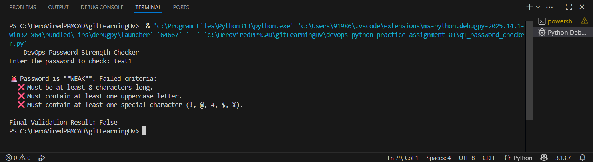
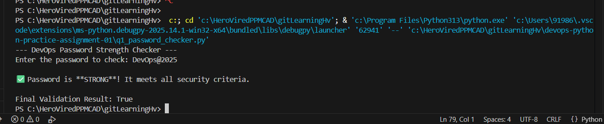
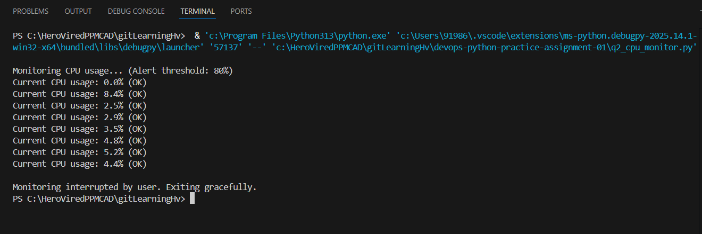
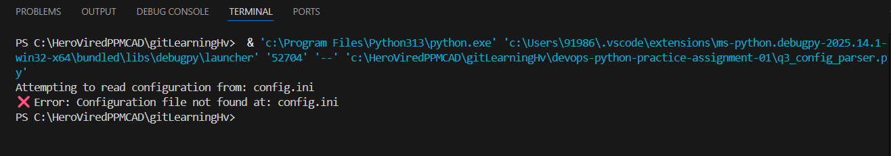
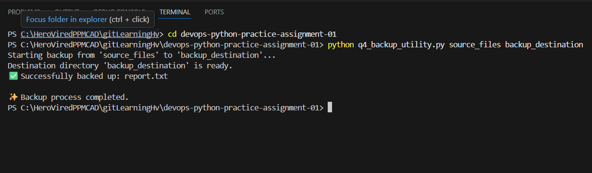
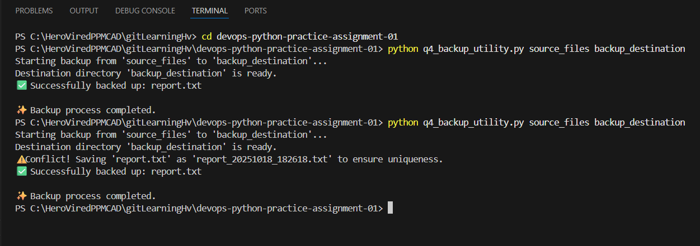

# DevOps Python Practice Assignment 01

This repository contains the completed solutions for the Python practice assignment, demonstrating core DevOps skills in **Security**, **Monitoring**, **Configuration Management**, and **Automation/Backup**.

## Solutions Included

| Question | File Name | DevOps Concept | 
| :--- | :--- | :--- | 
| **Q1** | `q1_password_checker.py` | Security Policy Enforcement | 
| **Q2** | `q2_cpu_monitor.py` | System Monitoring | 
| **Q3** | `q3_config_parser.py` | Configuration Management & API Simulation | 
| **Q4** | `q4_backup_utility.py` | Automation & Disaster Recovery | 

## Prerequisites

To run the scripts, you will need:

* Python 3.x

* For Q2: The `psutil` library. **Install it once:**

  ```bash
  pip install psutil


  ## How to Run

| Script | Command Example | Notes | 
| :--- | :--- | :--- |
| **Q1** | `python q1_password_checker.py` | Prompts for password input. | 
| **Q2** | `python q2_cpu_monitor.py` | Runs indefinitely. Use **Ctrl + C** to stop. | 
| **Q3** | `python q3_config_parser.py` | Requires `config.ini` to be in the same directory. | 
| **Q4** | `python q4_backup_utility.py source_files backup_destination` | Requires both directories (`source_files` and `backup_destination`) to exist in the project root. |


## Demonstration Outputs

### Q1: Password Strength Checker (Security)

Example run showing a weak password failing multiple checks.



Example run showing a **strong password** meeting all criteria.



### Q2: CPU Health Monitor (Monitoring)

Continuous monitoring output, showing status and graceful shutdown.



### Q3: Configuration File Parser (Config Management)

Output showing successful reading, JSON saving, and final parsed structure display.



### Q4: File Backup Utility (Automation)

**Initial Run:** Output showing the successful backup, which returns the `report.txt` file on the first/initial run.



**Conflict Run:** Output showing the conflict resolution logic where a timestamp is appended to the file name on the second run.

